# Segment map preparation for road-centre line maps

|||
|:---|:--|
|**Authors:**| Kolovou Ioanna|
|**Reviewed by:**| Abhimanyu Acharya|
|**Revision**| 1.0|
|**Date**| 16 February 2018|
| **Copyright**| Copyright :copyright: 2018 by Space Syntax Ltd. This work is licensed under a [Creative Commons Attribution 4.0 License](https://creativecommons.org/licenses/by/4.0/) **Please read the license before sharing or editing this file.**|

This is the documentation of the set of processes that a researcher or practicioner needs to undergo to prepare a road-centre line (RCL) map prior to segment angular analysis. The processes are sequential and the whole segment map preparation should be seen as an iterative process, where the analyst needs to iterate through the processes until the segment map does not have any errors or misrepresentations.   

**Contents**
<!-- TOC depthFrom:1 depthTo:6 withLinks:1 updateOnSave:1 orderedList:0 -->

- [Segment map preparation for road-centre line maps](#segment-map-preparation-for-road-centre-line-maps)
	- [Checklist](#checklist)
	- [1. Projection](#1-projection)
	    - [In what CRS is my map projected?](#chapter-1a)
	    - [What is the best projected CRS to use?](#chapter-1b)
	    - [How to georeference my map?](#chapter-1c)
	    - [How to save your map with a projected CRS?](#chapter-1d)
	- [2. Size](#2-size)
	    - [How to define my study area?](#chapter-2a)
	    - [How to define the radii for my analysis?](#chapter-2b)
	    - [How to crop my map?](#chapter-2c)
	    - [Another method for cropping your map..](#chapter-2d)
	    - [My map is too big..](#chapter-2e)
	    - [Filtering OpenStreetMap road categories..](#chapter-2f)
	- [3. Topological errors](#3-topological-errors)
	    - [What geometry types exist?](#chapter-3a)
	    - [Understanding spatial relationships..](#chapter-3b)
	    - [Understanding topological relationships..](#chapter-3c)
	    - [What are the unlinks?](#chapter-3d)
	    - [How to clean my RCL map?](#chapter-3e)
	- [4. Simplification](#4-simplification)
	    - [What is the Douglas-Peucker algorithm?](#chapter-4a)
	    - [How should I add or edit lines in my map?](#chapter-4b)
	    - [How to simplify my RCL map?](#chapter-4c)
	    - [Can I process a map without simplifying it?](#chapter-4d)
	- [5. Update](#5-update)
	    - [My map is too big to update it...](#chapter-5a)
	    - [Is my map still cleaned of topological errors?](#chapter-5b)
	- [6. Segmentation](#6-segmentation)
	- [7. Verification](#7-verification)
	    - [Axial Verification](#chapter-7a)
	    - [Unlinks Verification](#chapter-7b)
	- [Recommended reading](#recommended-reading)

<!-- /TOC -->

## Checklist

Below is a summary of the steps for preparing a segment map from a RCL map. It is recommended that you use this as a checklist.
Details for each process are provided in the following sections.

| Seq. | Steps                    | Does my map ...                                                       | Check                 |   |
|------|--------------------------|-----------------------------------------------------------------------|-----------------------|---|
| 1    | **Projection**           | ...have a **projected** CRS?                                          | :black_square_button: |   |
| 2    | **Size**                 | ...have a **reasonable size**?                                        | :black_square_button: |   |
| 3    | **Topological &**        | ...have **multi-geometries**?                                         | :black_square_button: |   |
|      | **Geometrical errors**   | ...have **invalid geometries**?                                       | :black_square_button: |   |
|      |                          | ...have **point geometries**?                                         | :black_square_button: |   |
|      |                          | ...have **duplicates**?                                               | :black_square_button: |   |
|      |                          | ...have **overlaps**?                                                 | :black_square_button: |   |
|      |                          | ...have **crossing lines**?                                           | :black_square_button: |   |
|      |                          | ...have **closed polylines**?                                         | :black_square_button: |   |
|      |                          | ...have **isolated lines**? - orphans                                 | :black_square_button: |   |
|      |                          | ...have **islands**?                                                  | :black_square_button: |   |
|      |                          | ...have **disconnections**?                                           | :black_square_button: |   |
|      |                          | ...have **short lines**?                                              | :black_square_button: |   |
| 4    | **Simplification**       | ...have **parallel lines**?                                           | :black_square_button: |   |
|      |                          | ...have unnecessary **angular changes**?                              | :black_square_button: |   |
|      |                          | ...have **traffic details, such us roundabouts and traffic islands**? | :black_square_button: |   |
|      |                          | ...have **squares**?                                                  | :black_square_button: |   |
|      |                          | ...have **open spaces**?                                              | :black_square_button: |   |
| 5    | **Over-representation**  | ...have **multiple lines representing a continuous space**?           | :black_square_button: |   |
|      | **Under-representation** | ...have **missing connections**?                                      | :black_square_button: |   |
|      |                          | ...have **alignments** that can be **optimised**?                     | :black_square_button: |   |
| 6    | **Segmentation**         | ...have been **segmented**?                                           | :black_square_button: |   |
| 7    | **Verification**         | ...have been **verified**?                                            | :black_square_button: |   |
|      |                          | ...unlinks been **verified**?                                         | :black_square_button: |   |

## 1. Projection

>:white_check_mark: **The RCL map MUST have a projected CRS**

>:x: **The RCL map MUST NOT be unprojected or projected in a geographic CRS.**

The coordinate reference system (CRS) of your map should be projected using meters as units, as opposed to geographic which uses degrees, minutes, seconds (DMS) coordinates.  For UK it is recommended to use the `British National Grid 27700` CRS.

:bulb: **In what CRS is my map projected? Is it projected or geographic?**

To find out the CRS of your map load the map in a new workspace in QGIS. Double-click on the layer to open **Layer Properties**. You can see the CRS of the file in the **General tab** under **Coordinate reference system**. If the field is similar to: `USER100000: *- Generated CRS` this means that the map is not georeferenced. This is very common with CAD files, as they are not native GIS file types and therefore do not hold any geographical information.

To find whether a CRS is projected or geographic, open the Coordinate Reference System Selector by right-clicking on the layer in the **Layers Panel** and clicking on **Set Layer CRS**. Check under which category the selected CRS appear.

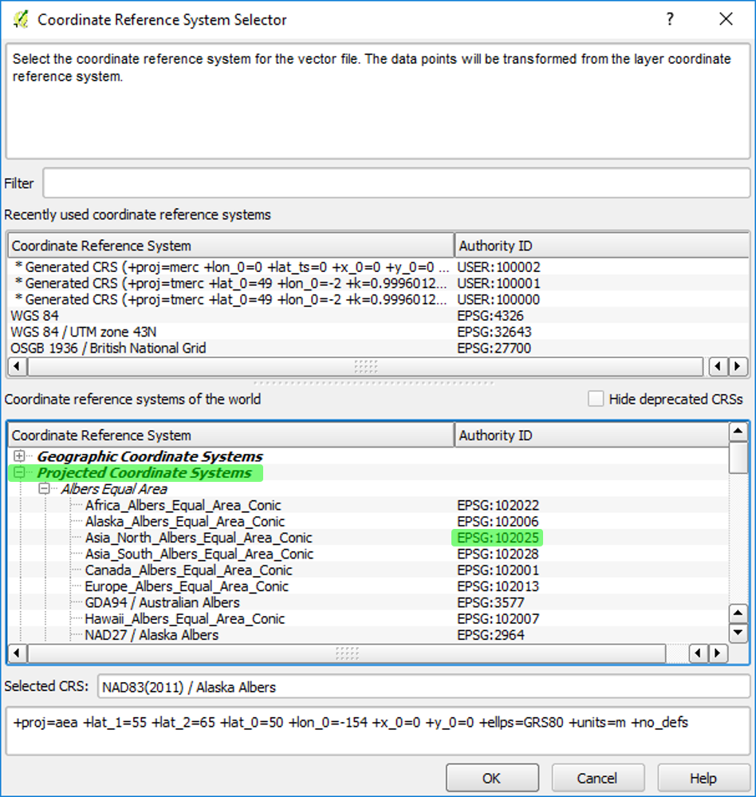

:bulb: **What is the best projected CRS to use?**

Most geographical areas have multiple CRSs from which you can choose. To select the most appropriate CRS check what is the CRS of any of the other GIS data you have for the same region. All the data should be using the same projected CRS.

You can use the following resources to identify the appropriate CRS:

[epsg registry](http://www.epsg-registry.org/)

[projfinder](http://projfinder.com/)

[UTM map](http://www.dmap.co.uk/utmworld.htm)

:bulb: **How to georeference my map?**

If your map does not have a CRS, you need to georeference the map in order to provide geographical information of where this map lies in the World. This is necessary prior to any GIS analysis. To georeference the map use the [Vector Bender](https://github.com/olivierdalang/VectorBender) plugin in QGIS.

:bulb: **How to save your map with a projected CRS?**

In order to change the CRS of a layer and preserve those changes, you need to save the file as a new file. Changing the CRS from the **Layer Properties**, does not save the CRS with the layer; it only re-projects the layer visually. To save the layer with the new CRS, right-click on the layer in the **Layers Panel** and select **Save as...**.  Select the desired CRS and the destination to save the file and click **OK**.

## 2. Size

>:white_check_mark: **The RCL map MUST be double the size of the radius used in the analysis**

>:x: **If the radius of your RCL map is smaller than the radius of your analysis, then you SHOULD be cautious about the accuracy of the analysis results**

You may need to crop your map to make sure that processing time is reasonable. In principle, you should buffer the polygon defining your study area at the same distance as the largest radii you plan to use in the analysis.

:bulb: **How to define my study area?**

You should define a study area at the beginning of a project. Your map should always be bigger than the study area. To define the study area, assess what is the area you require accurate results for. Your study area can be as small as a development site or a neighbourhood and as big as a city or even a country.

:bulb: **How to define the radii for my analysis?**

To decide on the radii you choose to analyse assess the scales you want to explore. Regional scales can be as big as global radius n, city-wide scale depends on the size of the city and local scales can be as small as 400 metre. Below follows an example for the area of Greater London. You need to adjust this method for your study area size and city's analysis scale.  

|       | Scale         | Radii        |
|-------|---------------|--------------|
| MACRO | REGIONAL      | 20K - 10K    |
| MESO  | CITY-WIDE     | 10K - 5K     |
| MICRO | NEIGHBOURHOOD | 800m - 2000m |

You should analyse the system at multiple radii to find which radii best defines the spatial condition you are exploring. This is one of the biggest strengths of Space Syntax analysis; the simultaneous analysis of a city at its different scales of function.  

:bulb: **How do I crop my map?**

To crop your model, create a polygon of the study area. Buffer the polygon by a fraction bigger than the largest radii you will use. You should buffer for a slightly larger radius than the one you want to analyse because the analysis measures distance through the network, while the buffer will be based on 'as the crow flies' straight line distance.

In QGIS you can use the `Select by Radius` selection tool to select features based on a circle with your study area as the centre.

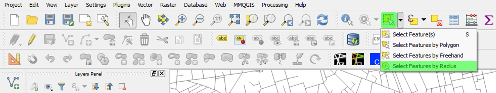

:bulb: **Another method for cropping your map..**

Another method for cropping a map is using natural boundaries to shape your map, for example topography (e.g. hills/ forests etc.) or major road arteries (e.g. motorways). For example, in London you can use the M25 motorway as a natural boundary.

:bulb: **My map is too big..**

Having a very big map is not a problem, unless the processing time is very long. If so, crop the map as suggested above.

:bulb: **Filtering OpenStreetMap road categories..**

It is common with OpenStreetMap data to remove road categories from your map that are not relevant to your analysis. These could be: `cycleways`, `bridleways` , `track`, `track_grade`. In some cases road categories that are too detailed for a strategic analysis, for example `footways` and `pedestrian` could also be removed when your analysis focuses on a city scale. If your analysis is looking at local conditions then it is important to keep such connections in your map. Make sure that you are not creating any important disconnections, when you remove each category.

To determine which categories to include in your map, apply a `Categorized style` to your map in QGIS. In the `Layer Properties`, select the `Style` tab and select `Categorized` from the drop-down menu.  Select to visualise the column `fclass`, press `Classify` and `OK`. You can change the colours if necessary. Then try to turn on and off different road categories under your layer in the Layer Panel to decide which categories to keep.

Once you have selected the categories you want to keep, you should save the selected features as a new layer. After selecting the layers you are interested in keeping, select all the features visible in the **Map Canvas**, right-click on the layer and select `Save as..`. In the dialogue that opens make sure you tick `Save only selected features` before saving the file.

## 3. Topological errors

>:white_check_mark: **The RCL map MUST be clean of topological errors**

>:x: **The map MUST not have topological errors as this may affect or even abort the analysis**

A map is analysed as a set of relations between its nodes. Therefore the map should be cleaned of any topological errors to ensure accurate analysis results. The table below summarises the most common topological errors found in vector maps, what action is required to fix each error and examples per error.

| Topological errors | Description | Cleaning action required | Before cleaning          | After cleaning            |
|--------------------|-------------|--------------------------|-----------------|----------------|
| **multi-geometries**   | Multi-geometries are collections of single-part geometries. A multi-linestring can consist of multiple linestrings. | Convert to single geometries |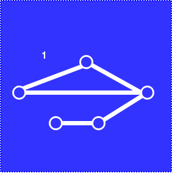 |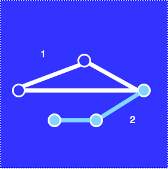 |
| **invalid geometries** | The geometry does not comply to OGC standards (incl. self-intersecting features)| Delete/Fix invalid geometries     |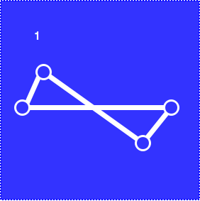 |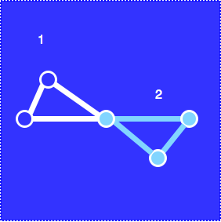 |
| **empty geometries**   | Features without specified geometry            | Delete empty geometries     | | |
| **point geometries**   | Point features            | Delete point geometries|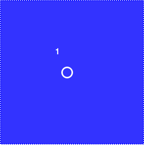 | |
| **duplicates**         | Two or more features with identical geometry            | Delete duplicate geometries |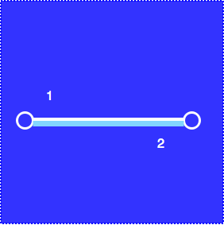 | |
| **overlaps**           | Two or more overlapping features            | Delete shortest overlapping line |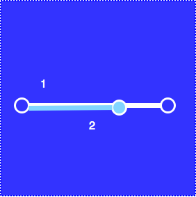 |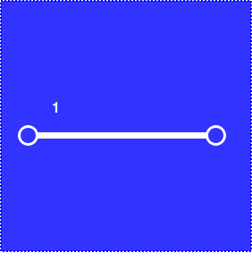 |
| **crossing/touching lines** | Two features that cross/touch other            | Break lines |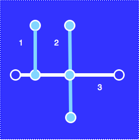 |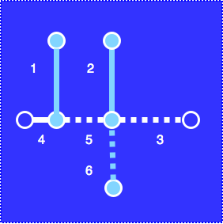 |
| **closed polylines**        | A feature with same start and end point| Break lines (when connected to other lines)/ Delete closed polylines (when disconnected from other lines) |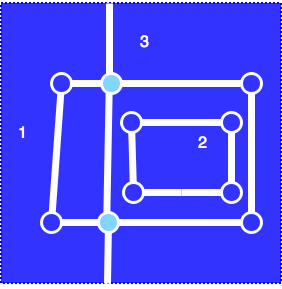 |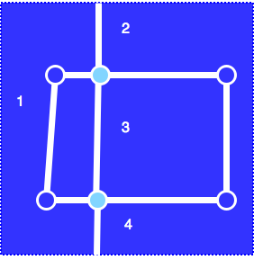 |
| **isolated lines** (orphans)  | A feature that is not connected to any other feature | Connect to the network if possible or delete them |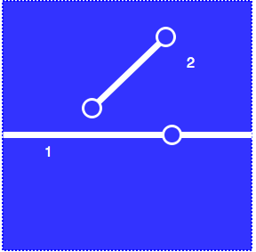 |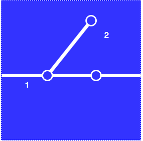 |
| **islands**                 | A feature that is not connected to any other feature    | Connect to the network  if possible or delete them (unless genuine island) |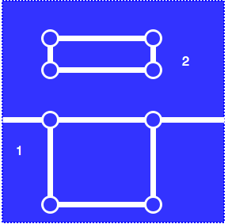 |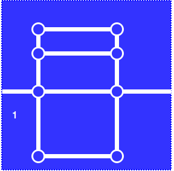 |
| **disconnections**          | When a feature does not share a common vertex with a feature close to it. Be careful of **invisible** disconnections | Connect to the network where appropriate|  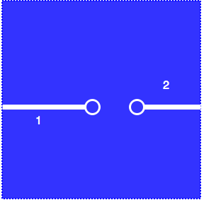 |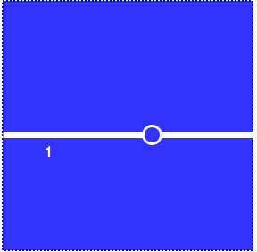 |

One of the most challenging errors to find is **disconnections**. When features (segments or polylines) share vertices they are topologically connected. Below are examples of simple and complex cases of disconnections.

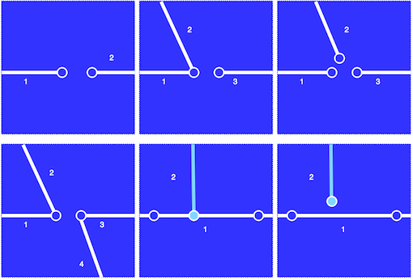

:bulb: **What geometry types exist?**

The most common geometry types are shown below:

[source](https://automating-gis-processes.github.io/2017/lessons/L1/Geometric-Objects.html)

**Linestring validity** is defined mainly by the following rules:
1. A linestring MUST have two endpoints
2. A linestring MUST have length greater than 0 (points not allowed)
3. A linestring MUST NOT intersect itself (not always applied within GIS)
4. A linestring MUST be a single list of point geometries  

Read more about geometry standards by OGC in [4.3.5. Ensuring OpenGIS compliancy of geometries](https://postgis.net/docs/using_postgis_dbmanagement.html#OGC_Validity)

:bulb: **Understanding spatial relationships..**

A spatial relationship describes the ways in which two geometries relate two one another, what they have in common or not. In GIS terms, objects have a geographical signature and their relationships are defined in a geographical space.

The most common spatial relationships are illustrated below:

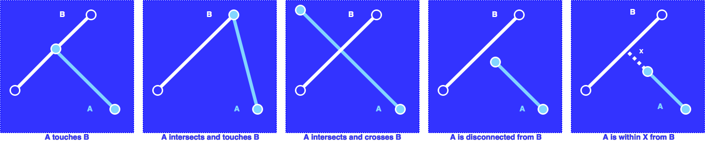

Spatial relationships are one of the most interesting fields of research in GIS. With respect to planning, the interaction of complex systems in space can help us acquire meaningful insights on how cities function.

:bulb: **Understanding topological relationships..**

A topological relationship describes the relation between two elements in graph. The graph in our case is the street network and topological relationships, such as proximity, connectivity, adjacency etc. offer a means of analysing the configurational properties of a network.

- At this stage it is essential to understand how different ways of drawing a map affects how topological relations are read.
    - In a traditional **axial map**, two lines (spaces) are connected where lines cross. Axial lines have only two endpoints.
    - In a **segment map**, two lines are connected only if their end vertices are connected. Segments have only two endpoints.
    - In a **polyline map**, two lines are connected if their end or intermediate vertices are connected. Polylines can have many points.   
    - There are cases when you may find yourself with a map that mixes some or all of the above categories. These cases need cautious treatment at later stages, especially during segmentation.  

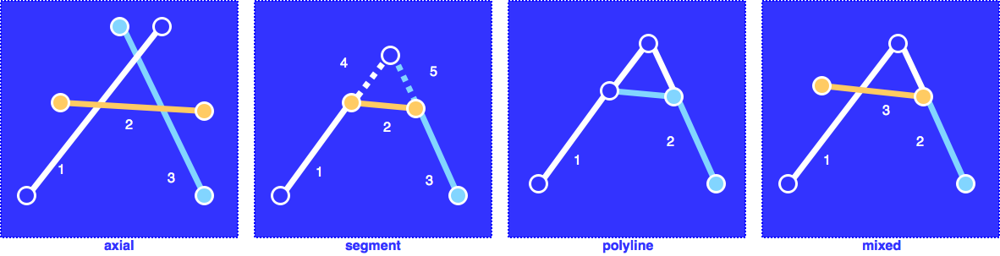

:bulb: **What are the unlinks?**

An unlink is where two lines cross but do to touch each other. The RCL map might hold information of unlinked segments, typically found where level differences appear e.g. bridges, underpasses etc. Usually maps coming from official sources hold this information represented as a unique spatial relation. The conventional representation is two lines crossing each other but not sharing a vertex. The crossing points compose a GIS layer with a unique id and the ids of the lines that cross. The unlinks layer has three attributes; a unique id `id`, the id of the first crossing line `line1` and the id of the second crossing line `line2`.

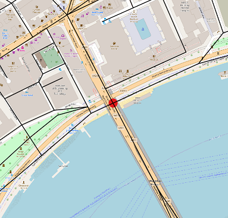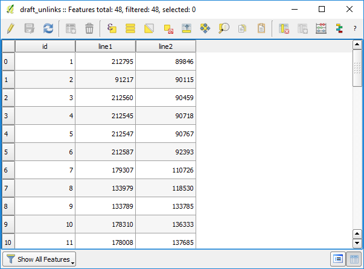

Unlinks can become a complicated issue, when your map does not follow the conventional RCL standard. This has been observed in OS data, where unlinked lines cross and share a vertex and in maps that have not undergone any kind of validation. Having unlinks is essential in order to **distinguish unlinked segments from lines that need to break** when you will clean and segment your map later on. There are two possible cases required for unlinks. Select the most appropriate method from the following:

1.  If the unlinked segments in your map follow the conventional representation then you do not require to generate unlinks. However, if you make any changes in your map you need to follow the same principle for all other unlinks you may add or edit. Therefore it is recommended to generate an unlinks layer in order to help you visually identify them.
2. If the unlinked segments in your map do not follow the conventional representation, then it is most likely that you need to generate an unlinks layer manually.

:bulb: **How to clean my RCL map?**

Cleaning is a complicated and challenging process as errors might appear during the cleaning process. Some of the tools used for cleaning one error might provoke other errors. Therefore it is important to check the result after any process. To do so follow the suggested workflow below:

1. **First, fix your maps using the RCL Cleaner.** The table below shows the cases that the plugin can fix.

| Topological & geometrical errors | RCL Cleaner                                          |
|----------------------------------|------------------------------------------------------|
| **multi-geometries**             | :white_check_mark:                                   |
| **invalid geometries**           | :white_check_mark:                                   |
| **empty geometries**             | :white_check_mark:                                   |
| **point geometries**             | :white_check_mark:                                   |
| **duplicates**                   | :white_check_mark:                                   |
| **overlaps**                     | :white_check_mark:                                   |
| **crossing/touching lines**      | :white_check_mark: (only where lines share a vertex) |
| **closed polylines**             | :white_check_mark:                                   |
| **isolated lines/orphans**       | :white_check_mark:                                   |
| **islands**                      |                                                      |
| **disconnections**               | :white_check_mark: (only decimal precision)          |

RCL Cleaner plugin has an option to generate unlinks as a temporary layer. However, this function is based on the input data and unlinks are produced where lines are not sharing a vertex. In OpenStreetMap data the unlinks produced are therefore many more than in reality, whereas in OS data the unlinks are just about right. For any other dataset, is not known whether unlinks are represented conventionally or if they are represented at all.  In addition, the RCL Cleaner plugin will break crossing or touching lines where they share a vertex. Whereas this works fine with OpenStreetMap data, it does not work well with OS Open Roads data. The unlink verification process that will follow in a later stage is an additional validation process. See table below for some examples and caveats.

:warning: RCL Cleaner plugin has two known bugs reported [here](https://github.com/spacesyntax/Rcl-topology-cleaner/issues). Therefore you should not use the snap option and when saving a temporary layer you should leave the output name as `cleaned`. These issues will be fixed in the next release of the plugin.

| Datasources examples | Crossing/Touching lines action required  | Unlinked lines action required   | Recommendation                                                                                                                           |
|----------------------|------------------------------------------|----------------------------------|------------------------------------------------------------------------------------------------------------------------------------------|
| OpenStreetMap        | Break at shared vertex                   | Don't break at non-shared vertex | Use RCL Cleaner plugin to break your layer. For unlinks layer clean your layer twice to get the correct unlinks. Save your unlinks layer |
| OS Open Roads        | Break only at touching vertices          | Don't break at shared vertex     | Use RCL Cleaner plugin. Use the unlinks layer generated to re-merge your unlinked segments.                                              |
| (usually unofficial) | Break at any intersecting/touching point | Unknown                          | Use v.clean break tool and draw unlinks manually.                                                                                        |

If you need to create an unlinks layer manually, select `Layer` > `Add Layer` > `Add vector Layer...` in QGIS. Create a point layer with the following settings. Make sure you select the CRS for the unlinks layer the same as the CRS of your segment layer.

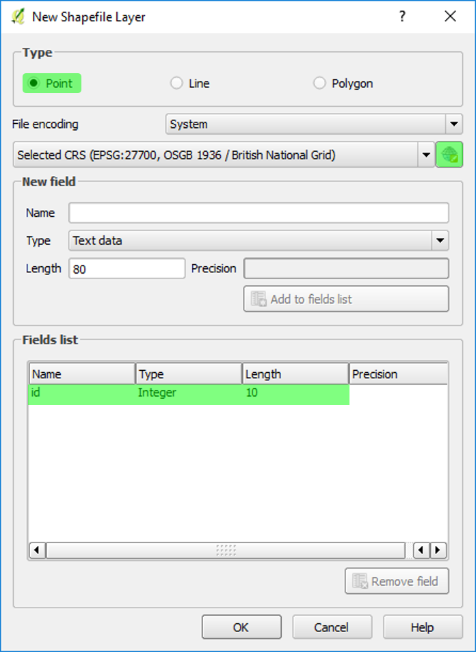

2. **Then check your map of any remaining topological errors** using the tools below. Do not worry about errors that cannot be fixed at this stage, as they will be fixed at a later stage.

| Topological & geometrical errors | QGIS: Select by expression | Topology Checker   |
|----------------------------------|----------------------------|--------------------|
| **multi-geometries**             |                            | :white_check_mark: |
| **invalid geometries**           |                            | :white_check_mark: |
| **empty geometries**             | $geometry IS NULL          |                    |
| **point geometries**             | $length=0                  |                    |
| **duplicates**                   |                            | :white_check_mark: |
| **overlaps**                     |                            |                    |
| **crossing lines**               |                            |                    |
| **closed polylines**             | startvertex = endvertex    |                    |
| **isolated lines/orphans**       |                            |                    |
| **islands**                      |                            |                    |
| **disconnections/small lines**   |                            | :white_check_mark: (only dangles)     |

3. **If there are still any errors fix them** using other GIS tools as suggested in the table below. Do not worry about errors that cannot be fixed at this stage, as they will be fixed at a later stage.

| Topological & geometrical errors | QGIS Grass 7 algorithms | MMQGIS                                 |PST Create segment map | POSTGIS               |
|----------------------------------|-------------------------|----------------------------------------|-----------------------|-----------------------|
| **multi-geometries**             |                         | `Modify > Convert Geometry Type`       |                       | `ST_Dump`             |
| **invalid geometries**           |                         |                                        |                       | `ST_ISValid`          |
| **empty geometries**             |                         |                                        |                       |                       |
| **point geometries**             |                         |                                        | :white_check_mark:    |                       |
| **duplicates**                   | `v.clean (rmdupl)`      | `Modify > Delete Duplicate Geometries` | :white_check_mark:    | `Partition OVER geom` |
| **overlaps**                     |                         |                                        |                       |                       |
| **crossing lines**               | `v.clean (break)`       |                                        | :white_check_mark: (everywhere unless unlinks table provided) | |
| **closed polylines**             |                         |                                        |                       |                       |
| **isolated lines/orphans**       |                         |                                        |                       |                       |
| **islands**                      |                         |                                        |                       |                       |
| **disconnections**               | `v.clean (snap)`        |                                        |                       |                       |

4. It should be noted that the **verification process** which happens at a later stage is also going to help identify such errors. **You do not necessarily need to verify your layer now.**

| Topological & geometrical errors | SSxToolkit         |
|----------------------------------|--------------------|
| **multi-geometries**             | :white_check_mark: |
| **invalid geometries**           | :white_check_mark: |
| **empty geometries**             | :white_check_mark: |
| **point geometries**             | :white_check_mark: |
| **duplicates**                   | :white_check_mark: |
| **overlaps**                     | :white_check_mark: |
| **crossing lines**               |                    |
| **closed polylines**             |                    |
| **isolated lines/orphans**       | :white_check_mark: |
| **islands**                      | :white_check_mark: |
| **disconnections/small lines**   | :white_check_mark: |

## 4. Simplification

>:white_check_mark: **The RCL map MUST be simplified from lines that over-represent spaces**

>:x: **The RCL map MUST NOT have traffic details**

When segment maps are derived from RCL maps you should reduce over-articulated curves and remove extraneous road traffic details. A RCL map is a transport network and therefore needs to be transformed to represent space as suggested by Space Syntax theory.

The **principles of simplification** follow the principles of the axial map, where the fewest and longest axial lines through space are drawn. The principles are:

1. The **optimisation of angular change** between continuous intersections:  minor angular changes between continuous segments should be eliminated where space allows it. (picture 1)
2. The **reduction of nodes** in the dual graph representation of the network: small redundant segments over-representing spaces can be removed and connections should be restored. (picture 2)

- images

:bulb: **What is the Douglas-Peucker algorithm?**

Douglas-Peucker algorithm is a generalisation algorithm used in cartography to reduce the number of vertices that represent a digitised line. We use this algorithm to reduce the number of vertices of polylines between intersections in order to represent space as continuous entities and minimise unnecessary angular changes. It is important to point out that the lines of your map must be polylines between intersection for this algorithm to work. If your map is a segment map, then the algorithm will return the same map. You can use the RCL Cleaner plugin to convert your segment map in a polyline map.

This is an illustration of how the algorithm works on a polyline:

[source](https://commons.wikimedia.org/wiki/File:Douglas-Peucker_animated.gif)

:bulb: **How should I add or edit lines in my map?**

Since your starting point is a RCL map, at this stage of the process your map should consist of polylines between intersections. You should be cautious about how you choose to model because this will impact the way you segment your map at a following stage.

The are three ways in which you can draw: **axial,  segments and polylines**. According to the way you choose to model, the processes that follow change slightly:
- If you have drawn as **segments or/and polylines**, you **DO NOT** need to segment your map at the following stage. You also do not need to explode your map if you process with the SSxToolkit. If you are using any other software to process your map it is recommended to explode you map. Unlinks should be represented as crossing lines that do not share a vertex.
- If you have drawn as **axial lines**, you need to **segment**. Also, before segmenting you need to have a verified layer of unlinks.
- If you have drawn **both as axial lines and as segments**, you need to **segment** using a verified layer of unlinks.

| Options      | Modelling rules                | Topological rule & Snapping setting                                                                                 | Correct                                 | Wrong                                 | Segmentation required                                                            |
|--------------|--------------------------------|---------------------------------------------------------------------------------------------------------------------|-----------------------------------------|---------------------------------------|-------------------------------------------------------------------------|
| **Axial**    | Only two vertices permitted    | Endpoints of line do not connecting to other endpoints. No snap required                                            | 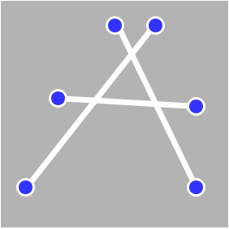  | 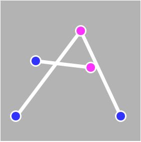  | :white_check_mark:                                     |
| **Segment**  | Only two vertices permitted    | Endpoints of line connecting to other endpoints. **Snap to vertex required**                                        | 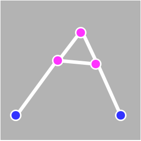 | 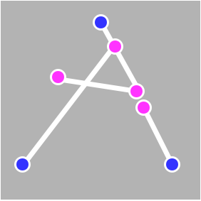 |                                                  |
| **Polyline** | Two or more vertices permitted | Vertices of lines connecting to other vertices (including intermediate and end points). **Snap to vertex required** | 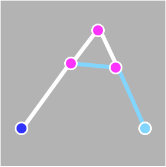  | 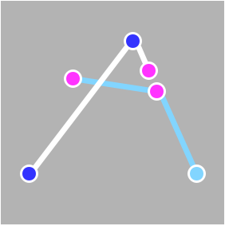  | |
| **Hybrid**   | Mixed modelling techniques     | Only snap to vertex when drawing segments or polylines                                                              | n/a                                     | n/a                                   | :white_check_mark:                               |

Using the `Node tool` tool in QGIS you can transform the vertices of a feature. Use the `Add Feature` button to add a line in your map and the `Delete Selected` to delete selected features from your map.   

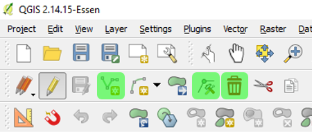

When editing lines you will find useful to enable snapping, so as to connect lines at their common points. In QGIS select `Settings` and then `Snapping options` to enable snapping. It is recommended to use the **snap to vertex** option in the Snapping settings. **NEVER** use snap to segment, as this option snap vertices to any intermediate vertex of a feature. Snapping to segment creates conditions where line touch but do not intersect. Change with the snapping tolerance when the snapping does not function appropriately while editing lines.

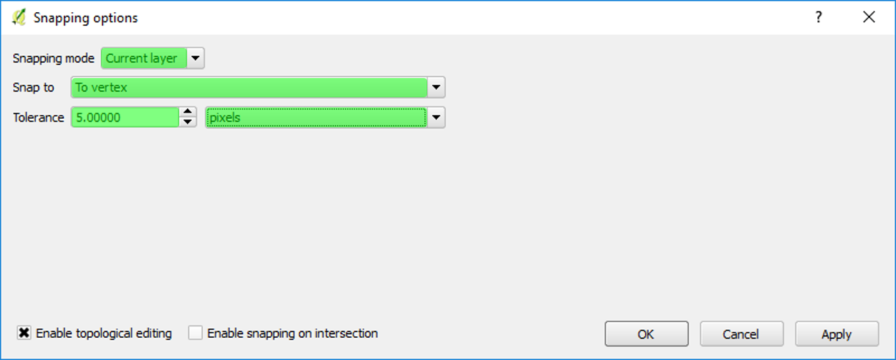

If you want to move the shared vertex of multiple features use the **topological editing** option in the Snapping settings. It should be noted that this setting can also help you identify disconnections. If when moving a vertex, one or some of the connected lines do not move together with the vertex then they are disconnected.

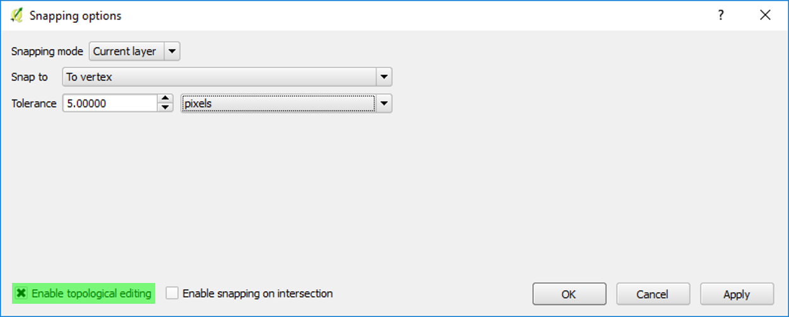

The option of **snapping to intersection** should be used only for drawing unlinks. It should be deactivated when you draw lines.

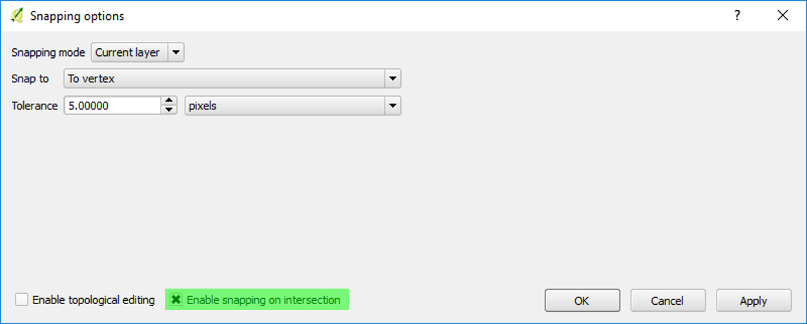

:bulb: **How to simplify my RCL map?**

The simplification process can be a very time consuming process. Follow the suggested workflow described below to efficiently simplify your map:

1. **Specify the resolution of your model**.

Simplifying a big map manually can be a very time-consuming process. You should always bare in mind that the analysis of your RCL map is an approximation. It is suggested that the map is simplified manually to a radius as big as the largest local radius you will be using around the borders of the site in interest. It is obvious though that this might not be possible for global radii or when the area of interest is quite big (e.g. a city). In such cases it is recommended that you make sure that the primary (Foreground) network is simplified and you can leave the background with no or few simplification cases.

2. **Simplify unnecessary angular changes automatically**. After you have used the RCL Cleaner plugin at the previous stage, your map should consist of polylines between intersections. Use the Douglas-Peucker algorithm to remove redundant vertices from polylines.

To apply the algorithm in QGIS, you need to convert your map to a polyline map using the RCL Cleaner plugin and then use the `Simplify Geometries` tool. You need to specify a distance tolerance for the simplification.

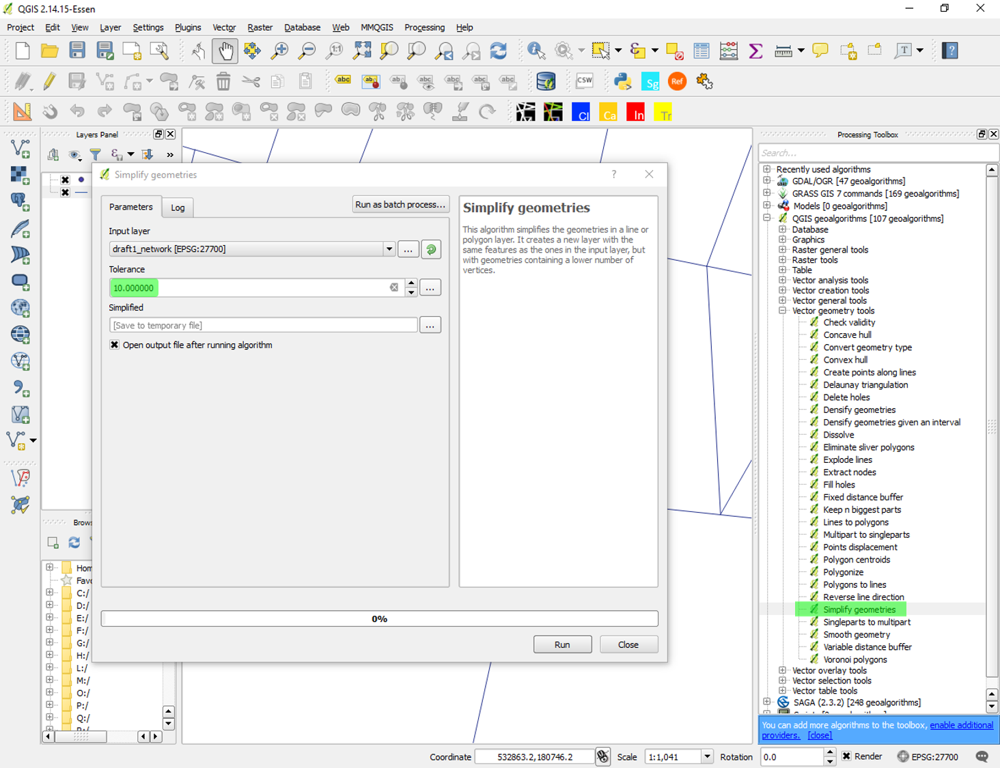

3. **Detect other cases that require simplification** using the instructions below.

The table below shows examples of cases that require simplification. In order to detect such cases in your map, you should scan visually your map, with an emphasis on the primary network where most cases will appear. Some of the cases can be also detected automatically either by using a threshold of a minimum segment length or by using the attributes of your map. Using the attributes of the map is very dependant on the data you are using. Therefore, you should not be entirely based on the attributes since most of the open data, especially OpenStreetMap data, is updated voluntarily and has many inconsistencies and missing values. You should always scan your map visually for any cases that may not be detected automatically.

| Simplification case     | Visual check | Automatic check                                                                     |   |
|-------------------------|--------------|-------------------------------------------------------------------------------------|---|
| **Parallel lines**      | :white_check_mark:              | QGIS: Select by attribute (e.g. formofway = 'Dual Carriageway' in OS, fclass IN ('primary', 'primary_link', 'secondary', 'secondary_link', 'motorway', 'motorway_link'), not always present in OpenStreetMap)      | |
| **Underpasses, overpasses and bridges** |  :white_check_mark:     |||
| **Roundabouts**         | :white_check_mark:              | QGIS: Select by attribute (e.g. formofway= 'Roundabout' in OS, not always present in OpenStreetMap |   |
| **Squares/Open spaces** | :white_check_mark:              | Overlay with OS Open Greenspace data        |   |
| **Short lines**         |              | QGIS: Select by expression `$length < XX`                                          |   |
| **Staggered junctions**|   :white_check_mark:                 | QGIS: Select by expression `$length < XX`                                          |   |
| **Angular change**     |  :white_check_mark:       | QGIS: When the layer is in edit mode, you can see the vertices of features. In `Settings > Options.. > Digitizing` In the `Vertex markers` section you can tick the box to \Show markers only for selected features`    |  |

4. **Simplify the cases you detected**  in step 3 using the modelling guidelines in the table below. The guidelines follow the principles of the axial map, where the fewest and longest lines are drawn through continuous spaces. The examples below can help you simplify similar cases in your map.

| Road detail                             | Modelling rule  |
|-----------------------------------------|---------------------------------------------------------------------------------------------------------------------------------------------------------------------------------------------------------------------------------------------------------------------|
| **Parallel lanes**                      | In a RCL map different lanes typically found in motorways and highways are represented by two parallel lines. An axial map is not directional. In these cases, parallel lanes are drawn as a single medial line.                                                    |
| **Underpasses, overpasses and bridges** | This rule is the easiest to implement as lines of RCL maps cross but not intersect where there is a level difference. Thus, the only requirement is when using DepthmapX that no unlinks layer is loaded and that the RCL map is directly converted to segment map. |
| **Roundabouts**                         | Roundabouts are simplified with straight links between consecutive entries or exits to the roundabout. Roundabouts with buildings in the middle can be treated similar to urban blocks.                                                                             |
| **Squares**                             | Connections are drawn between all “entry” and “exit” points to a square. If two points are directly visible and accessible a straight link is drawn between them. The cartographer should attempt to draw the least number of lines with all possible connections.  |
| **Staggered junctions**                 | When two almost parallel lines can be approached by a slight change in direction of movement a diagonal line can be drawn.                                                                                                                                          |

 **Roads examples**  

|| Parallel lanes | Curved continuous routes | Slip roads | Slip roads |
|--|:----------------:|:--------------------------:|:------------:|:------------:|
|Before|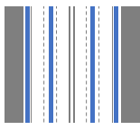  |   |   | 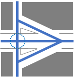  |
||   |   |   |   |   |
|After|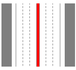 |  |   |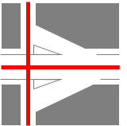 |

**Level difference examples**        

||Bridges | Stairs/ Ramps without directional turn |  Stairs/ Ramps with directional turn |  
|--|:----------------:|:--------------------------:|:------------:|
|Before|   |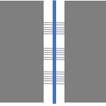   |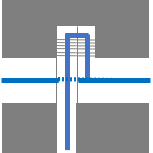    |||
||   |   |   |   |   |
|After| 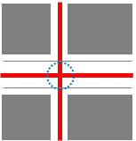  |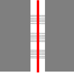  |  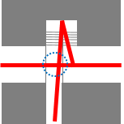    | 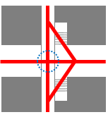 |  |   

**Roundabouts examples**

||With buildings | Without buildings |
|--|:---------------:|:-------------------:|
|Before|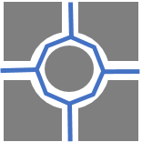|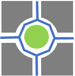|
||   |   |
|After|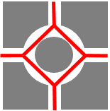| |

**Parks examples**      

||Parks |   |   | Gated parks/ gardens|
|--|:------:|:---:|:---:|:---------------------:|
|Before|    |  |  |   |
||   |   |   |   |
|After|  | |  |  |

**Squares and Open spaces**

||Rectangular open spaces/ squares |   |   | Triangular open spaces/ squares|
|---|:---------------------------------:|:---:|:---:|:--------------------------------:|
|Before|  |  |||
||   |   |   |   |
|After|   | || |

**Staggered junctions examples**

||Trivial rings | Short lines|
|--|:--------------:|:------------:|
|Before| |    |||
|   |   |   |   |
|After|  | | | |

:bulb: **Can I process a map without simplifying it?**

Results of non simplified RCL maps are inaccurate. Weak correlations of the analysis results between non-simplified and axial maps implies that it is most likely inaccurate to analyse a RCL map as a raw dataset.

If you need to do a quick analysis results, the minimum requirements is to have simplified angular changes in your map using the Douglas-Peucker algorithm and to scan visually the primary network of your map to check for any possible disconnections or missing lines. The analysis results cannot be trusted for local radii.     

## 5. Update

>:white_check_mark: **The user SHOULD edit the RCL map to add lines where space is under-represented, edit lines where space is misrepresented and remove lines where space is over-represented.**

>:x: **The user SHOULD BE cautious when analysing a map that has not been updated, as the analysis results might be inaccurate especially in local radii.**

The RCL data you are using might have some inconsistencies of lines not appearing where streets exists or lines appearing where streets do not exist in reality. Therefore, the map should be edited in three possible ways:

1. Lines should be **added** where connections between streets are missing.
2. Lines should be **updated** where connections are misaligned.
3. Lines should be **removed** where connections do not exist.

The unlinks layer can also be edited in the same three ways as your map. If you do not have an unlinks layer and all the unlinked segments are represented as crossing lines you do not need to generate a layer. If you do not have an unlinks layer and the unlinked segments are not consistently represented, it is recommended to generate a layer and verify the unlinks.

The use of a mapping service can help you identify such cases, for example Google maps, Google street view, OpenStreetMap etc. [OpenLayers](https://github.com/sourcepole/qgis-openlayers-plugin) plugin in QGIS gives you options of different base-mapping web layers. The update method can be also be used for creating hypothetical maps of future scenarios. In those cases you may want to consider using the [Georeferencer](https://docs.qgis.org/2.18/en/docs/user_manual/plugins/plugins_georeferencer.html) plugin to register a raster image of the proposed layout.

:bulb: **My map is too big to update it...**

You do not need to update all your map. When you look at local radius it is important to update an area around your site as big as the radius of your local analysis. When you look at global scales it is important to scan the primary network visually to ensure that the most strategic connections are taken correctly into account in the analysis. When you look at global and local scales of analysis, you need to do both.

:bulb: **Is my map still cleaned of topological errors?**

It is likely the simplification and update process may have created new topological errors. In any case, it is recommended to check for errors again during the verification process. Do not worry at this stage; the axial verification process will help you identify those errors later.

## 6. Segmentation

>:white_check_mark: **The map MUST be segmented before processing.**

>:x: **Results of angular analysis on any other map than a segment map may produce invalid results**

At this stage, you should have identified previously whether or not you need to segment your map. According to the way you have edited your map and your unlinks layer, you need to segment in different ways, as described earlier. Use the following tools to segment your map and pay attention to the notes.

| Segmentation tool | Function                                                                                                    | Know issues   |
|-------------------|-------------------------------------------------------------------------------------------------------------|---------------|
| [Network Segmentor](https://github.com/spacesyntax/NetworkSegmenter) | Breaks lines where they cross or intersect, requires unlinks, stubs are removed based on  percentage length | missing lines |
| [PST](https://www.smog.chalmers.se/pst)               | Break lines where they cross or intersect, requires unlinks , stubs are removed based on length             | no output     |
| v.clean break     | Break lines where they cross or intersect, does not accept unlinks, does not removes stubs| You need to recreate the unlinks if you use this tool.|

## 7. Verification

>:white_check_mark: **Before processing the map SHOULD be verified.**

>:x: **Unverified maps can affect or even abort the analysis.**

Verification should be the last step before analysing your map. The verification process can identify any topological errors that either were not fixed the tools or they have been produced in the process.

:bulb: **Map verification**

It should be noted that although your map is not axial, [Axial verification](https://github.com/SpaceGroupUCL/qgisSpaceSyntaxToolkit/wiki/Verifying-the-axial-map) can still be used for RCL maps.

:bulb: **Unlinks verification**

[Unlinks verification](https://github.com/SpaceGroupUCL/qgisSpaceSyntaxToolkit/wiki/Verifying-the-unlinks)

## Recommended reading

Dhanani A, Vaughan L., Ellul Cl., Griffiths S., 2012, From the axial line to the walked line: evaluating the utility
of commercial and user-generated street network datasets in space syntax

Douglas, D. H. and Peucker, T. K. (1973) ‘Algorithms for the Reduction of the Number of Points Required for Represent a Digitized Line or its Caricature’, Cartographica (The Canadian Cartographer), 10(2), pp. 112–122.

Kolovou I., Gil J.,Karimi K.,Law St.,Versluis L.,(2017) ROAD CENTRE LINE SIMPLIFICATION PRINCIPLES FOR ANGULAR SEGMENT ANALYSIS, 11th International Space Syntax Symposium
July 2017, Methodological and tecgnical developments http://www.11ssslisbon.pt/docs/proceedings/papers/163.pdf

Krenz K., 2017, EMPLOYING VOLUNTEERED GEOGRAPHIC INFORMATION IN SPACE SYNTAX ANALYSIS, 11th International Space Syntax Symposium July 2017, Space society & sustainability http://www.11ssslisbon.pt/docs/proceedings/papers/163.pdf

Serra M., Pinho P., 2013, Tackling the structure of very large spatial systems - Space syntax and the analysis of metropolitan form, The journal of Space Syntax, Volume 4, Issue 2

Turner A., 2000, Angular analysis a method for the quantification of space, paper 23, CASA working paper series

Turner, A., 2005, Could a road-centre line be an axial line in disguise? Proceedings of the 5th International Symposium on Space Syntax, TU Delft (Techne Press, Amsterdam) Vol. 1 pp. 145-159.

Turner, A., 2007. From axial to road-centre lines: a new representation for space syntax and a new model of route choice for transport network analysis. Environment and Planning B: Planning and Design 34, 539–555.doi:10.1068/b32067
